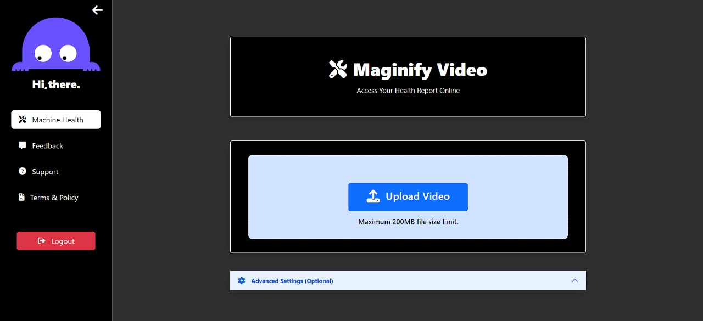
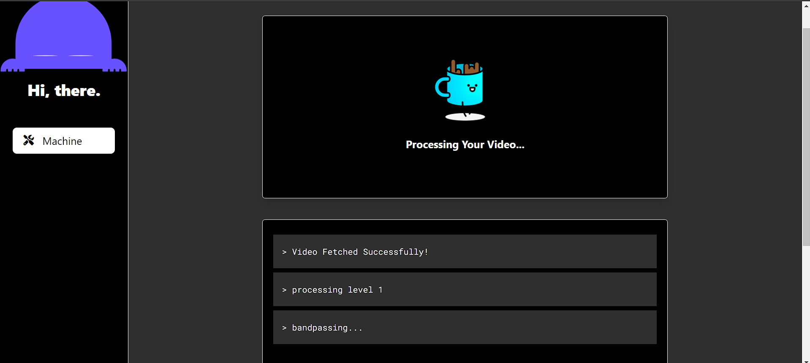
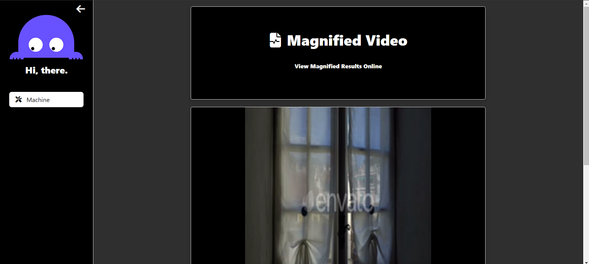
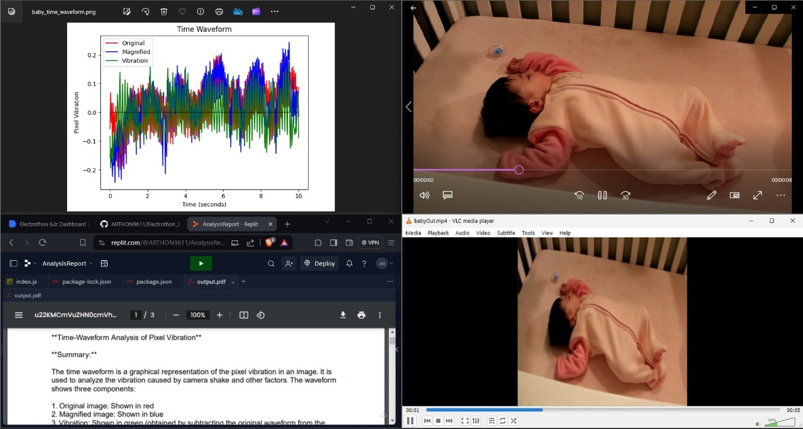
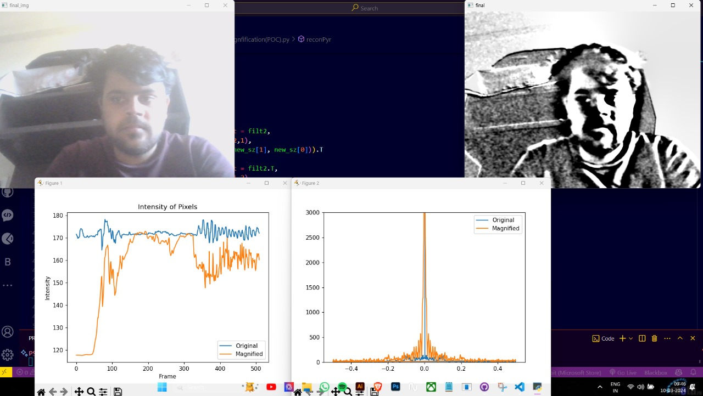

# (PulseLens Agent)

PulseLens Agent is a cutting-edge solution that combines Video Magnification, Computer Vision, and Machine Learning to monitor both human and machine health. It uses the IO Net Agent to analyze original and magnified videos, generating vibration graphs and detailed reports. This enables non-contact, visual diagnostics for early anomaly detection and preventive maintenance across biomedical and industrial settings.

# Working:

Video Upload & Magnification
The user uploads a video through the client. The Magnification Server processes it using Phase and Euclid-based video magnification to reveal subtle vibrations.

Graph & Data Generation
The processed video is sent to the Graph Generation Server, which extracts movement data and creates graphs. This data is then analyzed via IO Net Intelligence API.

Insightful Report Creation
The analyzed results are forwarded to the Report Generation Server, which compiles a human-readable report combining original and magnified data insights.


# Frontend:







# Analysis Report:


# Live Magnification


## Features

- **Eulerian Video Magnification**: Enhance video footage to make subtle motion patterns, vibrations, and color changes more visible.
- **Human Health Analysis**: Utilize video footage to examine human movements, generate health parameter graphs using computer vision, and provide detailed health reports using machine learning algorithms.
- **Use Cases**:
  - Respiratory Rate Monitoring: Identify irregular breathing patterns and track breath frequency.
  - Heart Rate Monitoring: Continuously monitor heart rate to assess cardiovascular health and fitness levels.
  - Aircraft Engine Health Analysis: Assess aircraft engine health by detecting vibrations and micro-scale defects to prevent unexpected failures.

## Dependencies

- Flask: Python web framework for backend development.
- OpenCV: Computer vision library for video processing.
- TensorFlow/Keras: Machine learning framework for developing health analysis models.
- IO Net Intelligence : For graph generation and analysis

## Show Stoppers

- Universal Device Compatibility: Ensure flawless performance across a spectrum of devices, including web, windows and Android platforms.
- Real Time Motion Magnification using Frame-By-Frame Difference of Vibrations.

  # Overview
Harnessing Video Magnification, Computer Vision, and Machine Learning Algorithms, the system provides comprehensive insights into machinery and human health.

## Working Architecture
(Refer to the diagram in the project repo for a visual representation.)

### Backend:
1. **API Server for Magnification (Node.js):** Hosted on Replit for hackathon purposes, this server acts as an API server forwarding calls to the magnification server.

2. **Server Report Generator (Node.js):** Another API server hosted on Replit, responsible for making calls to the AI model with generated report images and objects extracted from frames. It calculates the average of responses from multiple calls and returns the result.

3. **Magnification Server (Flask):** A Python server that performs actual video magnification using Eulerian/phase magnification scripts. It processes the video and returns the magnified video link.

4. **Graph Generation Server (Python):** This component generates graphs from the magnified video. It sends images of the graphs and detected objects in the frame to the "Server Report Generator (Node.js)" via an API call.

5. **Live Magnification:** Developed as a proof of concept, this feature skips the process of applying filters and magnifies the video in real time. However, note that the magnification quality might not be optimal, and the video is grayscale.

### Frontend:
The React frontend allows users to select magnification parameters and upload videos to Cloudinary. The uploaded video link is then sent to the magnification server for further processing. Before uploading, the video undergoes cropping and preprocessing to reduce resolution and frame rate, thus reducing the load on the magnification server. Additionally, it utilizes web sockets for real-time logs for video magnification.


## Usage Magnification Server

1. Clone the repository:

   ```bash
   git clone https://github.com/preyanshu/pulse_lens_agent.git
   ```
2. CD into Magnification_Server:

   ```bash
   cd ./Magnification_Server
   ```

2. Install dependencies:

   ```bash
   pip install -r requirements.txt
   ```

3. Run the Flask application:

   ```bash
   python app.py
   ```

   DO THE SAME WITH REPORT AND GRAPH GEN SERVER.

   ## Usage Frontend

1. Clone the repository:

   ```bash
   git clone https://github.com/preyanshu/pulse_lens_agent.git
   ```

2. CD into Frontend:

   ```bash
   cd ./frontend
   ```

3. Install dependencies:

   ```bash
   npm i
   ```

4. Run the application:

   ```bash
   npm start
   ```

4. Access the application through the provided URL in your web browser at port 3000.


## Contributing

Contributions are welcome! Please open an issue or submit a pull request for any new features, improvements, or bug fixes.


